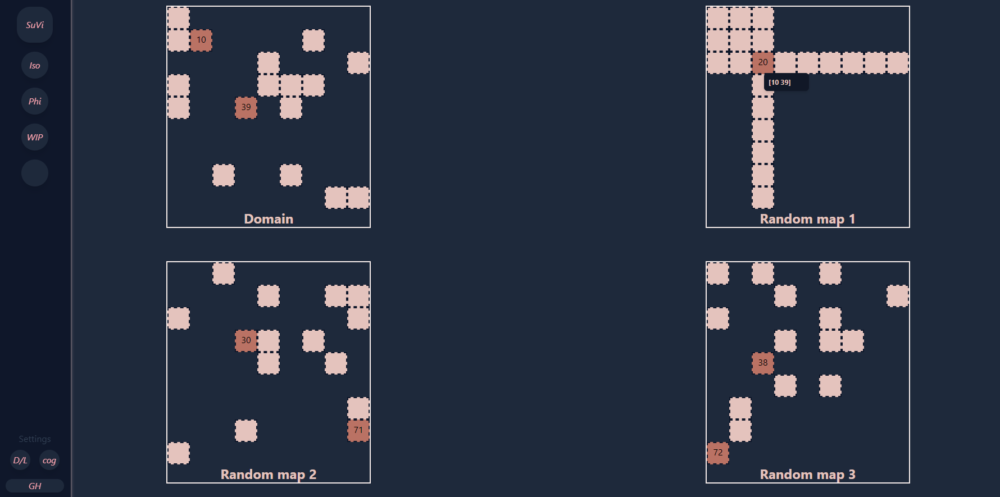

# automagic-sudoku
Gamify the programming of rules for sudoku to solve sudoku grids
automagically.

The rough plan is to play around with
    1. Creating a sudo creator/solver/ruleset creator. (zig?)
    2. Creating an interactive website to play. (htmx / golang?)

